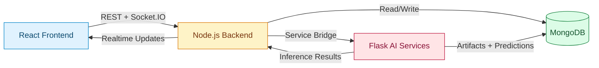

# StudyStream AI - Architecture Flow

This document presents the complete system design for:

1. Authentication and secure session access
2. Practice Mode and Real Exam Mode (adaptive intelligence + analytics)
3. Retention system (Micro, Meso, Macro LSTM layers)

It focuses on architecture, responsibilities, data contracts, and model behavior rather than endpoint-level route details.

---

## 1. Problem Statement

Modern learners face three recurring problems:

1. One-size-fits-all practice systems that do not adapt to individual pace and confidence.
2. Poor retention over time due to lack of intelligent revision timing.
3. Weak visibility into why performance changes across topics, sessions, and stress conditions.

StudyStream AI is designed to solve these problems with a real-time adaptive engine, sequence-based AI predictions, and retention-driven scheduling.

---

## 2. How StudyStream AI Solves It

StudyStream AI combines deterministic orchestration with predictive intelligence:

1. `React Frontend` captures live behavior signals and renders explainable analytics.
2. `Node.js Backend` controls session state, validation, persistence, and real-time event flow.
3. `Flask AI Backend` runs feature engineering, model inference, and asynchronous retraining.
4. `MongoDB` stores transactional history, analytics snapshots, and retention traces.

Core communication pattern:

`Frontend <-> Node.js (REST + Socket.IO) <-> Flask AI Bridge <-> MongoDB`

---

## 3. High-Level Architecture

### 3.1 Layer Responsibilities

| Layer                         | Primary Responsibility                                 | Key Outputs                                                  |
| ----------------------------- | ------------------------------------------------------ | ------------------------------------------------------------ |
| Frontend (React)              | Interaction capture, adaptive UI, visual analytics     | Event stream, behavior metrics, user feedback state          |
| Node.js (Express + Socket.IO) | Session lifecycle, security, validation, orchestration | Authoritative session state, summaries, real-time pushes     |
| Flask AI (TensorFlow/Keras)   | Feature prep, inference, retraining, scheduling        | Difficulty guidance, readiness insights, retention forecasts |
| MongoDB                       | Persistent operational + analytical storage            | Replayable history, model-ready datasets, audit trail        |

---

## 4. Authentication Architecture

### 4.1 Objective

Ensure identity trust, secure access, and correct session ownership across practice, exam, and retention workflows.

### 4.2 Conceptual Flow

1. User submits login/register credentials from frontend auth views.
2. Node.js validates identity and issues authenticated session tokens.
3. Frontend hydrates user state and attaches credentials on protected calls.
4. Middleware verifies identity before any protected data/action.
5. Socket sessions inherit authenticated context for secure real-time channels.

### 4.3 Security Controls

1. Credential validation and token verification.
2. Role and ownership checks for session-level resources.
3. Middleware guards before sensitive operations.
4. CORS/cookie policy alignment between frontend and backend services.

---

## 5. Practice + Real Exam Intelligence Architecture

### 5.1 Unified Session Flow

1. Frontend starts a session with learner intent and scope.
2. Node.js creates and manages authoritative session state.
3. Frontend captures timing, confidence, behavior, and answer transitions.
4. Node.js persists events and forwards modeling payloads to Flask.
5. Flask returns predictions and retrains asynchronously when thresholds are met.
6. Node.js streams updated analytics and predictions to frontend.
7. Frontend displays adaptive insights and final performance summaries.

### 5.2 Practice Mode

1. Adaptive practice session starts with subject/topic context.
2. Per-question loop captures behavior and correctness in real time.
3. Flask predicts next difficulty and confidence band.
4. Frontend applies short stability windows to avoid abrupt difficulty jumps.
5. Session completion triggers summary generation and model feedback ingestion.

### 5.3 Real Exam Mode

1. Readiness vector determines initial difficulty bias.
2. Timed question cycle streams answers through real-time channel.
3. Node.js updates score/analytics continuously.
4. Final submission or timeout generates authoritative result package.
5. Frontend renders final insights: accuracy, timing, weak areas, trend signals.

### 5.4 12 Analytics Intelligence Blocks

1. Concept Mastery Model
2. Stability Index Model
3. Confidence Calibration Model
4. Error Pattern Classification Model
5. Weakness Severity Ranking Model
6. Forgetting Curve Model
7. Fatigue Sensitivity Model
8. Cognitive Behavior Profile Model
9. Difficulty Tolerance Model
10. Study Efficiency Model
11. Focus Loss Detection Model
12. Adaptive Time Allocation Model

### 5.5 Trained Models vs Derived Models

`Trained in Flask`:

1. Practice difficulty sequence model
2. Exam difficulty sequence model
3. Learning velocity model
4. Burnout risk model
5. Global readiness model
6. Adaptive scheduling model

`Derived in analytics layer`:

1. The 12 explainability models computed from history and traces

This hybrid approach keeps UI analytics fast while preserving deep model guidance when data volume is sufficient.

---

## 6. Data Contracts

### 6.1 Raw Interaction Events (Realtime to Node.js)

1. `user_id` / `student_id`
2. `session_id`
3. `question_id`
4. `subject` / `topic` / `concept`
5. `selected_answer`
6. `correct_answer_flag` or equivalent correctness fields
7. `response_time`
8. `answer_changes`
9. `confidence_rating`
10. `hint_used`
11. `timestamp`
12. `device_focus_loss_event`

### 6.2 Practice Engineered Vector (12 Features)

1. `accuracy`
2. `normalized_response_time`
3. `rolling_time_variance`
4. `answer_change_count`
5. `stress_score`
6. `confidence_index`
7. `concept_mastery_score`
8. `current_question_difficulty`
9. `consecutive_correct_streak`
10. `fatigue_indicator`
11. `focus_loss_frequency`
12. `preferred_difficulty_offset`

Training target: `next_difficulty`

### 6.3 Real Exam Readiness Vector (8 Features)

1. `overall_accuracy`
2. `avg_difficulty_handled`
3. `readiness_score`
4. `consistency_index`
5. `trend_signal`
6. `concept_coverage_ratio`
7. `time_efficiency_score`
8. `stamina_index`

Expected exam outputs:

1. `recommended_difficulty`
2. `difficulty_band`
3. `confidence`
4. `insights` bundle

---

## 7. Retention Architecture (Micro, Meso, Macro LSTM)

### 7.1 End-to-End Retention Flow

1. Frontend starts retention session through Node.js.
2. Node.js streams question flow and stores session metrics.
3. Frontend sends raw and engineered retention signals.
4. Flask executes Micro, Meso, and Macro models.
5. Predictions and scheduling guidance return to Node.js.
6. Node.js persists to MongoDB and streams updates to frontend.
7. Final retention schedule and scores are generated for learner guidance.

### 7.2 Micro LSTM (Topic Level)

Purpose: Predict topic-level retention probability and near-term question difficulty.

Inputs (15 features): correctness, normalized response time, rolling topic accuracy, streak, time since last attempt, answer changes, confidence, concept mastery, question difficulty, fatigue indicator, focus loss frequency, rolling time variance, hint usage, preferred difficulty offset, topic attempt count.

Targets:

1. Retention probability
2. Next question difficulty
3. Correctness probability for next attempt

### 7.3 Meso LSTM (Subject Level)

Purpose: Predict subject mastery trajectory and revision priorities.

Inputs (15 features): subject accuracy, topic mastery vector, forgetting rate, performance trend, average response time, response time improvement rate, difficulty success rate, revision interval, topic switch frequency, incorrect pattern frequency, learning velocity, engagement score, fatigue trend, hint dependency, retention decay index.

Targets:

1. Subject retention score
2. Next topic revision priority
3. Optimal revision interval

### 7.4 Macro LSTM (Learning Path Level)

Purpose: Optimize long-term study planning across subjects.

Inputs (15 features): overall accuracy, cross-subject mastery vector, daily study duration, consistency index, fatigue pattern, forgetting curve slope, variability, start-time pattern, topic completion rate, efficiency score, break frequency, cognitive load index, motivation index, stress indicator, retention stability score.

Targets:

1. Optimal daily schedule
2. Subject priority order
3. Long-term retention forecast
4. Fatigue risk probability

### 7.5 Retention Payload Contract

In addition to raw events, the retention engine accepts:

1. `micro_features`
2. `meso_features`
3. `macro_features`
4. `derived_targets`
5. `schedule_hint`
6. `quality_signals`

The dual pathway (raw + engineered) improves resilience when one signal stream is sparse.

---

## 8. Analytics and Result Generation

At session completion, the system composes:

1. Overall score and accuracy
2. Response-time profile
3. Subject/topic mastery map
4. Difficulty-wise success map
5. Weakness-priority recommendations
6. Retention and fatigue guidance

Output strategy:

1. Backend summaries are authoritative.
2. Frontend modules provide explainable visual decomposition.

---

## 9. Societal Impact

StudyStream AI contributes beyond individual score improvement:

1. `Improved learning equity`: personalized pacing helps students with different backgrounds and speeds.
2. `Reduced burnout risk`: fatigue-aware scheduling discourages overloading and supports healthier study rhythm.
3. `Higher retention quality`: spaced and adaptive revision lowers forgetting and improves long-term outcomes.
4. `Actionable transparency`: explainable analytics helps students, teachers, and guardians make informed interventions.
5. `Scalable support`: AI-driven guidance can extend quality academic support where teacher bandwidth is limited.

---

## 10. Architectural Principles

1. Separate transactional orchestration (Node.js) from ML computation (Flask).
2. Preserve both raw and engineered data pipelines for robustness.
3. Use asynchronous retraining to protect user-facing latency.
4. Persist model artifacts and prediction history per learner.
5. Stream real-time analytics while maintaining backend-authoritative state.
6. Tie retention scheduling to model outputs with fatigue and stress safeguards.

---

End of architecture specification.
